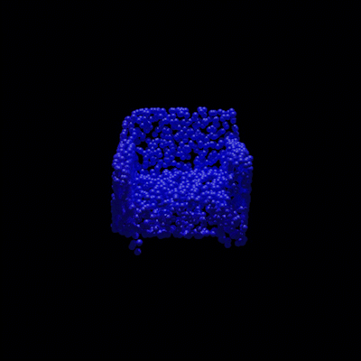

# Project for Natural Language Processing course: Text-driven Shape generation with Denoising Diffusion Models
## Installation
Python 3.8 is required.

Create and activate a virtual environment
```console
python -m venv env
source env/bin/activate
```

Install all the dependencies
```console
pip install -r requirements.txt
```

## Architecture
The architecture of this project is inspired by [PVD](https://arxiv.org/pdf/2104.03670.pdf), a method for unconditional point cloud generation.
The following figure, taken from this method summarizes the diffusion process, which allows to generate a point cloud from random noise.


The architecture of the trainable network which learns to estimate the noise applied to an input source, is shown in  the figure below.

The model receives as input the _noisy point cloud_, its corresponding time step _t_ and the _text_ describing the point cloud. The text prompt is processed by the Encoder Model of the large language model [T5](https://arxiv.org/pdf/1910.10683.pdf), which computes a text embedding. This text embedding is provided as input to the PVConv layers to predict the noise, conditioned on text.

In order to generate shapes directly from text, two conditional schemes have been implemented and evaluated:
* **Concatenation** of text features with point cloud features
* **Cross-attention** between text and point cloud features
The text-conditioning methods are implemented inside the PVConv layers of PVD, as shown in the figures below.


### Concatenation
The table below summarizes the architecture of PVConv (3 layers) in the concatenation text-conditioning scheme.
| PVConv x 3                   |
|------------------------------|
| Input: (x, t, text_embed)    |
| **Concat(X, t, text_embed)**       |
| 3x3x3 Conv, GroupNorm, Swish |
| Dropout                      |
| 3x3x3 Conv, GroupNorm, Swish |
| SelfAttention                |

### Cross-Attention
The table below summarizes the architecture of PVConv (3 layers) in the cross-attention text-conditioning scheme.
| PVConv x 3                   |
|------------------------------|
| Input: (x, t, text_embed)    |
| Concat(X, t)                  |
| 3x3x3 Conv, GroupNorm, Swish |
| Dropout                      |
| 3x3x3 Conv, GroupNorm, Swish |
| SelfAttention                |
| **CrossAttention(text_embed)**|
| **FeedForward**              |


## Data
This model has been trained on [Text2Shape](http://text2shape.stanford.edu/), the only existing dataset with paired 3D shapes and textual descriptions. Such dataset is limited to the chair and table categories of ShapeNet. Text2Shape provides a total of 75k shape-text pairs, referred to 15032 distint 3D shapes.


## Training
For the concatenation scheme:
```shell
python train.py --half_resolution --use_concat
```

For the cross-attention scheme:
```shell
python train.py --half_resolution
```

## Testing
When testing the trained models, we compute the metrics reported in [PVD](https://arxiv.org/pdf/2104.03670.pdf):
* MMD-CD: Minimum Matching Distance (using Chamfer Distance)
* COV-CD: Coverage (using Chamfer Distance)
* JSD: Jensen-Shannon Divergence

For the concatenation scheme:
```shell
python test.py --half_resolution --use_concat --model path/to/your/model.pth --eval_dir path/to/output/directory
```

For the cross-attention scheme:
```shell
python train.py --half_resolution --model path/to/your/model.pth --eval_dir path/to/output/directory
```

## Experimental results

### Quantitative results
|**method**         |**MMD-CD &darr;**   |**COV-CD &uarr;**         |**JSD &darr;**            |
|---------------|---------------|---------------------|---------------------|
|concatenation  |xxx %          |xxx %          |xxx %          |
|cross-attention|xxx %          |xxx %          |xxx %          |

### Qualitative results
The table below shows some quantative results of the text-driven generation process.
| text            | cross-attention             | concatenation              |
|-----------------|-----------------------------|----------------------------|
| "a sofa chair"  |  |  |
| "a round table" |   |   |

